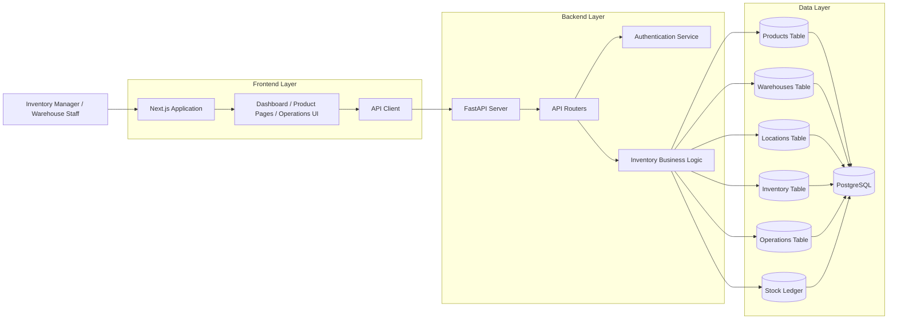
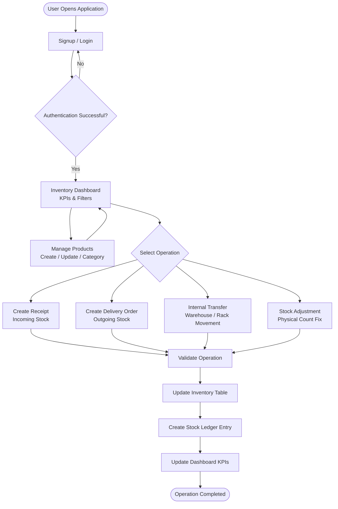

# CoreInventory

> A modular, web-based **Inventory Management System (IMS)** designed to replace manual registers and scattered tracking methods with a centralized, real-time, easy-to-use platform.

---

## Table of Contents

- [Problem Statement](#problem-statement)
- [Target Users](#target-users)
- [Tech Stack](#tech-stack)
- [System Architecture](#system-architecture)
- [Project Structure](#project-structure)
- [User Flow](#user-flow)
- [Features](#features)
  - [Authentication](#authentication)
  - [Dashboard](#dashboard)
  - [Product Management](#product-management)
  - [Receipts (Incoming Stock)](#receipts-incoming-stock)
  - [Delivery Orders (Outgoing Stock)](#delivery-orders-outgoing-stock)
  - [Internal Transfers](#internal-transfers)
  - [Stock Adjustments](#stock-adjustments)
- [Inventory Flow Example](#inventory-flow-example)
- [Database Schema Overview](#database-schema-overview)
- [API Overview](#api-overview)
- [UI Design System](#ui-design-system)
- [Development Setup](#development-setup)
- [Branch Strategy](#branch-strategy)
- [Current Development Status](#current-development-status)
- [Roadmap](#roadmap)

---

## Problem Statement

Businesses managing physical inventory often rely on manual registers, Excel sheets, and scattered tracking methods that are error-prone, hard to audit, and impossible to scale. **CoreInventory** solves this by providing a structured digital platform where every stock movement — from vendor receipt to customer delivery — is recorded, validated, and traceable through a central stock ledger.

---

## Target Users

| Role | Responsibilities |
|---|---|
| **Inventory Manager** | Manage incoming & outgoing stock, oversee KPIs |
| **Warehouse Staff** | Perform transfers, picking, shelving, and physical counting |

---

## Tech Stack

| Layer | Technology |
|---|---|
| **Frontend** | Next.js (App Router) + TypeScript |
| **Styling** | TailwindCSS |
| **Auth** | Supabase Auth (Google OAuth + JWT) |
| **Backend** | FastAPI (Python) |
| **Database** | PostgreSQL (hosted on Supabase) |
| **API Communication** | REST — JWT token passed via `Authorization` header |

> **Note:** Supabase is used only for authentication and database hosting. All business logic and API routing is handled by the FastAPI backend.

---

## System Architecture



### Authentication Flow

1. User logs in via Google OAuth through Supabase Auth.
2. Supabase issues a JWT access token to the frontend.
3. Frontend includes the token in the `Authorization` header on every API request.
4. FastAPI backend verifies the token using Supabase's JWKS before granting access.

---

## Project Structure

```
coreinventory/
├── frontend/                      # Next.js Application
│   ├── app/
│   │   ├── (auth)/
│   │   │   ├── login/             # Login page (Google OAuth)
│   │   │   ├── signup/            # Signup page
│   │   │   └── reset-password/    # OTP-based password reset
│   │   ├── dashboard/             # Inventory Dashboard + KPIs
│   │   ├── products/              # Product Management
│   │   ├── operations/
│   │   │   ├── receipts/          # Incoming Stock
│   │   │   ├── deliveries/        # Outgoing Stock
│   │   │   ├── transfers/         # Internal Transfers
│   │   │   └── adjustments/       # Stock Adjustments
│   │   └── settings/
│   │       └── warehouses/        # Warehouse Configuration
│   ├── components/                # Reusable UI Components
│   ├── lib/
│   │   └── supabaseClient.ts      # Supabase client utility
│   └── public/
│
├── backend/                       # FastAPI Application
│   ├── main.py                    # Entry point
│   ├── auth/                      # JWT verification via Supabase JWKS
│   ├── routers/                   # API route handlers
│   │   ├── products.py
│   │   ├── warehouses.py
│   │   ├── operations.py
│   │   └── inventory.py
│   ├── models/                    # SQLAlchemy DB models
│   ├── schemas/                   # Pydantic request/response schemas
│   └── services/                  # Business logic layer
│
└── README.md
```

---

## User Flow



---

## Features

### Authentication

- Email/password signup and login.
- Google OAuth via Supabase.
- OTP-based password reset flow.
- JWT-protected backend routes — all API calls require a valid Supabase token.

### Dashboard

The landing page after login. Shows a real-time snapshot of inventory health.

**KPIs:**
- Total Products in Stock
- Low Stock / Out of Stock Items
- Pending Receipts
- Pending Deliveries
- Internal Transfers Scheduled

**Dynamic Filters:**
- By document type: Receipts / Delivery / Internal / Adjustments
- By status: Draft, Waiting, Ready, Done, Canceled
- By warehouse or location
- By product category

### Product Management

- Create and update products with: Name, SKU/Code, Category, Unit of Measure, Initial Stock (optional).
- View stock availability per location.
- Manage product categories.
- Configure reordering rules.

### Receipts (Incoming Stock)

Used when items arrive from vendors.

**Process:**
1. Create a new receipt document.
2. Add supplier & product details.
3. Input quantities received.
4. Validate → stock increases automatically in the inventory table.
5. Stock ledger entry is created.

**Example:** Receive 50 units of "Steel Rods" → Stock +50.

### Delivery Orders (Outgoing Stock)

Used when stock leaves the warehouse for customer shipment.

**Process:**
1. Pick items from warehouse location.
2. Pack items.
3. Validate → stock decreases automatically.
4. Stock ledger entry is created.

**Example:** Delivery for 10 chairs → Chairs stock –10.

### Internal Transfers

Move stock within the company without changing total inventory count.

**Examples:**
- Main Warehouse → Production Floor
- Rack A → Rack B
- Warehouse 1 → Warehouse 2

Each movement is logged in the stock ledger. Location is updated; total quantity remains unchanged.

### Stock Adjustments

Reconcile mismatches between recorded stock and physical counts.

**Steps:**
1. Select product and location.
2. Enter the physically counted quantity.
3. System calculates the difference, auto-updates the inventory table, and logs the adjustment.

**Example:** 3 kg of steel found damaged → Stock –3, reason logged.

---

## Inventory Flow Example

| Step | Action | Effect |
|---|---|---|
| **Step 1** | Receive 100 kg Steel from Vendor | Stock: +100 |
| **Step 2** | Internal Transfer: Main Store → Production Rack | Stock total unchanged; location updated |
| **Step 3** | Deliver 20 kg Steel to customer | Stock: –20 |
| **Step 4** | Adjust 3 kg damaged steel | Stock: –3, logged as adjustment |

> Everything is logged in the **Stock Ledger** for full traceability and auditability.

---

## Database Schema Overview

| Table | Purpose |
|---|---|
| `products` | Product catalog (SKU, name, category, UOM) |
| `warehouses` | Warehouse registry |
| `locations` | Rack/shelf locations within each warehouse |
| `inventory` | Current stock levels per product per location |
| `operations` | Operation headers (Receipt, Delivery, Transfer, Adjustment) |
| `stock_ledger` | Immutable log of every inventory movement |

---

## API Overview

All routes are prefixed with `/api/v1/` and require a valid Bearer JWT token.

| Method | Endpoint | Description |
|---|---|---|
| `GET` | `/products` | List all products |
| `POST` | `/products` | Create a product |
| `GET` | `/warehouses` | List warehouses |
| `POST` | `/operations/receipts` | Create a goods receipt |
| `POST` | `/operations/deliveries` | Create a delivery order |
| `POST` | `/operations/transfers` | Create an internal transfer |
| `POST` | `/operations/adjustments` | Create a stock adjustment |
| `POST` | `/operations/{id}/validate` | Validate an operation (triggers stock update + ledger) |
| `GET` | `/inventory` | Get current stock levels |
| `GET` | `/stock-ledger` | Get full movement history |
| `GET` | `/dashboard/kpis` | Get dashboard KPI summary |

---

## UI Design System

The frontend follows a clean, modern enterprise design.

### Color Palette

| Role | Hex |
|---|---|
| Primary Accent (Teal) | `#00B5AD` |
| Primary Hover | `#009993` |
| Primary Text | `#1F2937` |
| Secondary Text | `#6B7280` |
| Page Background | `#F9FAFB` |
| Card Background | `#FFFFFF` |
| Border | `#E5E7EB` |
| Success | `#10B981` |
| Error | `#EF4444` |

### Typography

- **Font:** Plus Jakarta Sans
- **Headings:** Semi-bold (600) to Bold (700), letter-spacing `-0.02em`
- **Body:** Regular (400), line-height `1.6`

### Layout

- **Auth Pages:** Split-screen — 60% brand hero (teal gradient) / 40% form panel. Collapses to single column below 900px.
- **Dashboard:** Fixed sidebar (280px) with teal active states. Content area uses 40px padding with CSS Grid for KPI cards.

---

## Development Setup

### Prerequisites

- Node.js 18+
- Python 3.11+
- Supabase project (with Google OAuth configured)

### Frontend

```bash
cd frontend
npm install
cp .env.example .env.local
# Add your NEXT_PUBLIC_SUPABASE_URL and NEXT_PUBLIC_SUPABASE_ANON_KEY
npm run dev
```

### Backend

```bash
cd backend
python -m venv venv
source venv/bin/activate      # Windows: venv\Scripts\activate
pip install -r requirements.txt
cp .env.example .env
# Add SUPABASE_URL, SUPABASE_JWT_SECRET, DATABASE_URL
uvicorn main:app --reload
```

---

## Branch Strategy

| Branch | Purpose |
|---|---|
| `main` | Stable, production-ready code |
| `frontend/setup` | Next.js init, Supabase auth, login page, basic homepage |
| `backend/setup` | FastAPI project structure and initial server setup |

New features are developed on dedicated branches and merged into `main` via pull requests.

---

## Current Development Status

| Area | Status |
|---|---|
| Repository created & cloned | ✅ Done |
| Next.js frontend initialized | ✅ Done |
| Supabase Google OAuth configured | ✅ Done |
| Login page + redirect logic | ✅ Done |
| Basic homepage (auth test) | ✅ Done |
| FastAPI project structure | 🔄 In Progress |
| Backend JWT verification | ⏳ Pending |
| Product Management APIs | ⏳ Pending |
| Inventory Operations APIs | ⏳ Pending |
| Dashboard KPI endpoint | ⏳ Pending |
| Full frontend-backend integration | ⏳ Pending |

---

## Roadmap

- [ ] Finalize login flow, session handling, and protected routes
- [ ] Build dashboard layout with static KPI cards
- [ ] Connect frontend to FastAPI backend (auth-protected requests)
- [ ] Implement backend JWT verification via Supabase JWKS
- [ ] Product Management CRUD (API + UI)
- [ ] Receipts module (API + UI)
- [ ] Delivery Orders module (API + UI)
- [ ] Internal Transfers module (API + UI)
- [ ] Stock Adjustments module (API + UI)
- [ ] Stock Ledger view
- [ ] Low stock alerts
- [ ] Multi-warehouse support with location-level tracking
- [ ] SKU search & smart filters
- [ ] Settings — Warehouse & Location configuration

---

> **Design Mockup:** [Excalidraw Mockup](https://link.excalidraw.com/l/65VNwvy7c4X/3ENvQFu9o8R)
